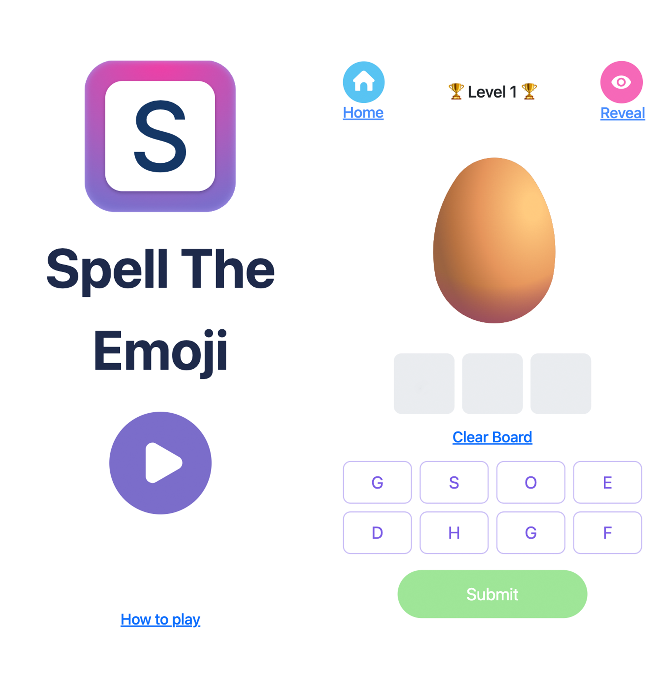
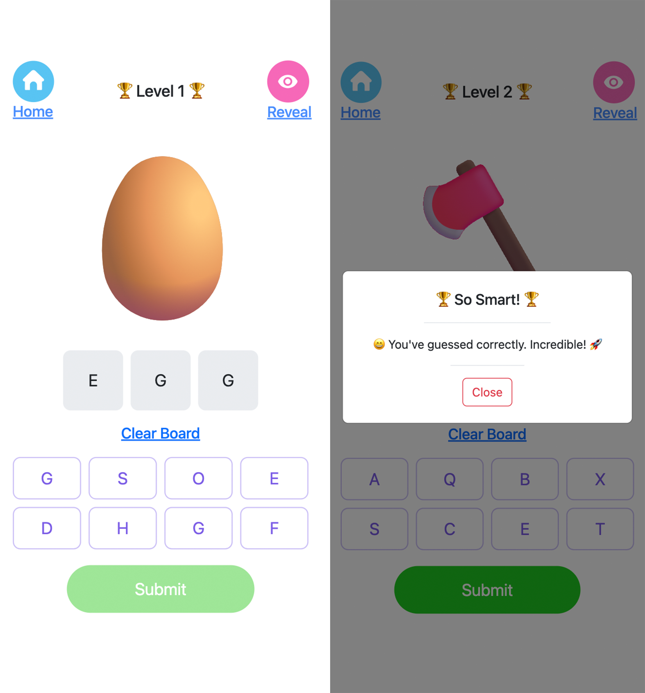
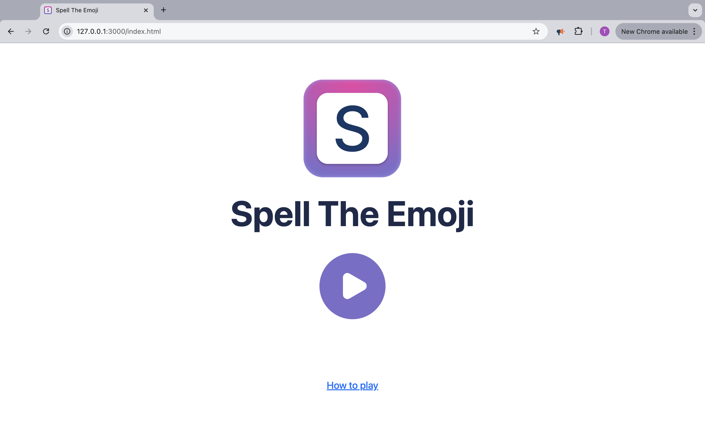
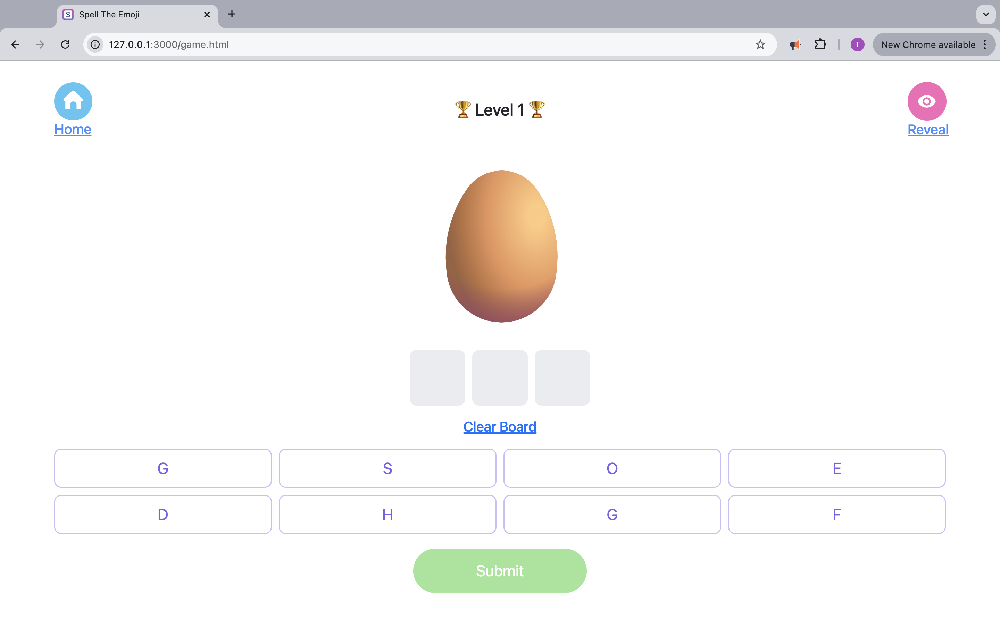
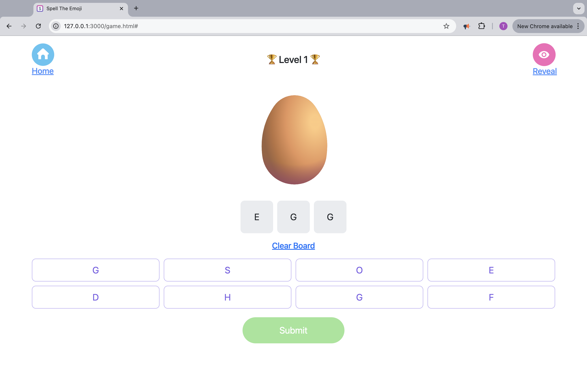
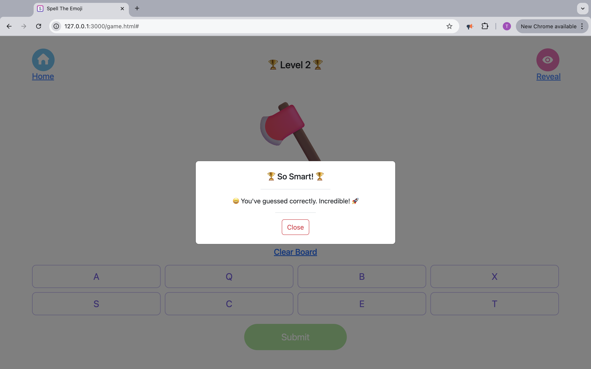

# Spell The Emoji

## Description

**Spell the Emoji: A Fun Emoji Word Game**

Step into the world of emoji puzzles! In this exciting fully responsive game, players are presented with a series of emoji images and tasked with spelling the word each emoji represents. With a wide range of categories—animals, objects, emotions, and more—this game challenges players to think creatively while improving their vocabulary. The goal is simple: decipher the emoji and spell the correct word. Perfect for players of all ages who love puzzles.

### Screen Shots (Mobile)

### How to play

1. **View the Emoji Image**  
   An emoji image will be displayed on the screen. Your goal is to guess the word or phrase that the emoji represents.

2. **Reveal**  
   If you’re stuck, use the "Reveal" option to uncover part of the answer to assist you in guessing right.

3. **Input Your Guess**  
   Input your guess into the provided text field using the given keyboard on screen and submit it to check if your answer is correct.

4. **Receive Instant Feedback**  
   After submitting, you’ll immediately see whether your guess is correct or incorrect, with being correct moving you up a level.

### Technologies Used

- Html
- CSS
- Bootstrap
- JavaScript

### Screen Shots (Desktop)

### User Stories

1. As a user, I want to be presented with an emoji image so that I can guess the word it represents.
2. As a user, I want to input my guess using a text field so that I can submit my answer and check if it’s correct.
3. As a user, I want to see immediate feedback after submitting my guess so that I know whether my answer was correct or not.
4. As a user, I want to see hints or clues if I’m stuck on an emoji so that I can continue playing without getting frustrated.

### Next Steps

1. Enable players to compete with friends or other users in real-time matches, adding excitement and a social element to the gameplay.
2. Introduce difficulty levels, allowing players to select easy, medium, or hard modes for a more tailored and challenging experience.
3. Implement a points system that tracks player performance, rewarding fast and accurate answers to encourage competitive play.
4. Add a countdown timer for each round, increasing the sense of urgency and making the game more engaging.
5. Enhance the user experience by introducing several features These will make the game feel more dynamic and responsive, providing players with a richer and more immersive experience.

## Author

Ayodeji Taiwo - [@Linkedin](https://www.linkedin.com/in/taiwo-a-80346223b/)
